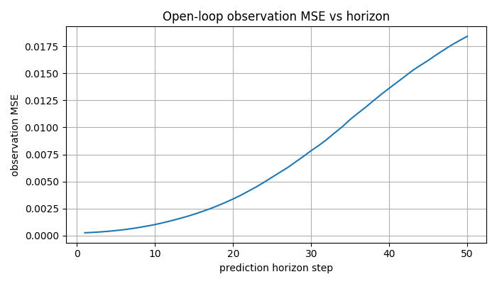
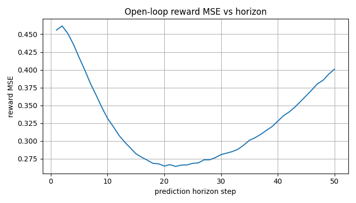
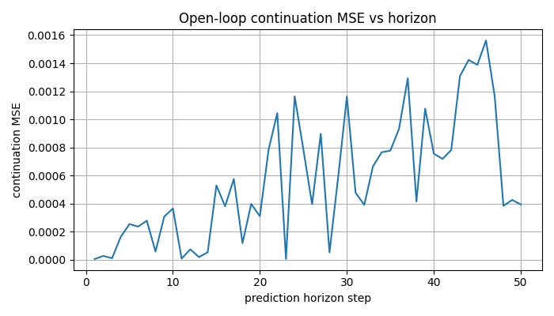
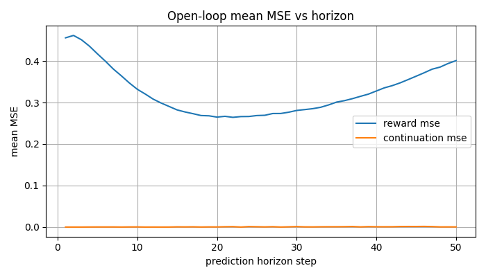
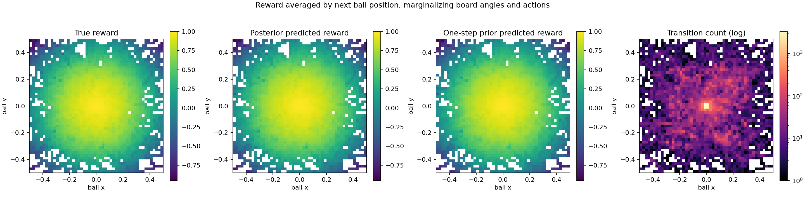
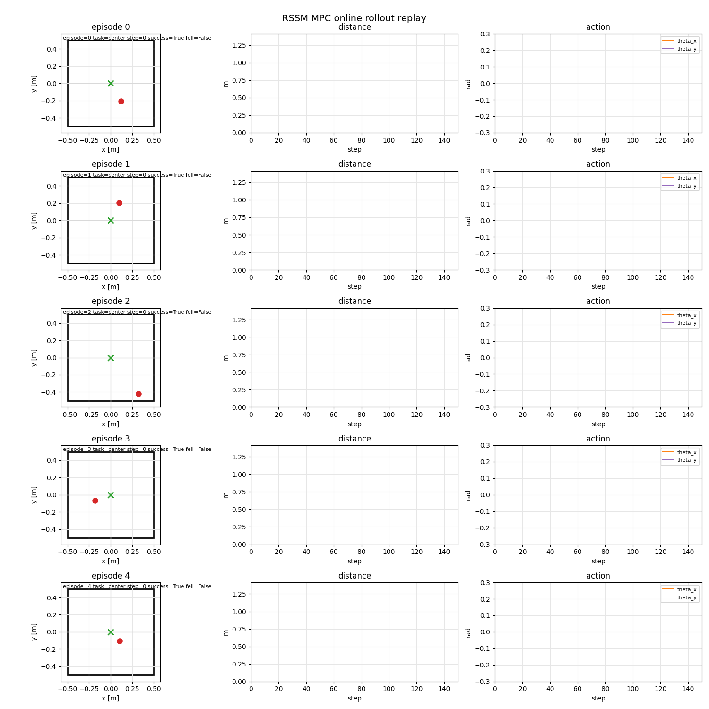
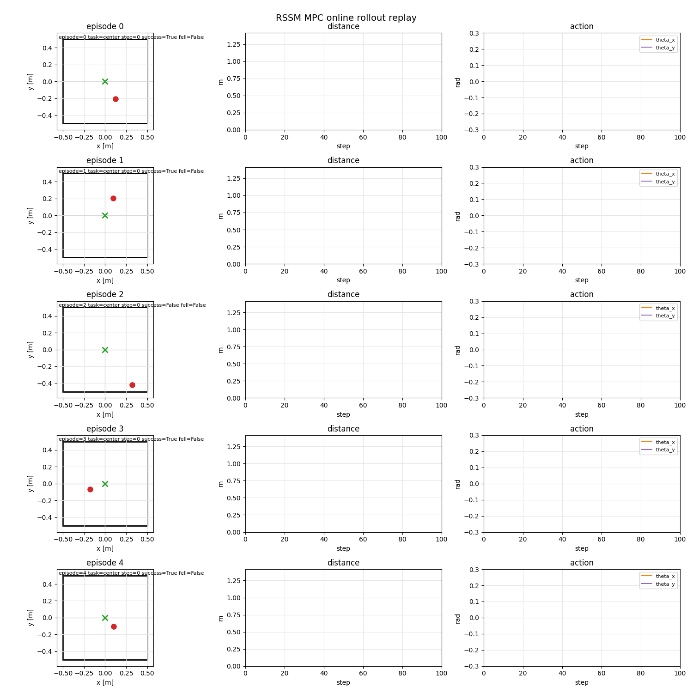
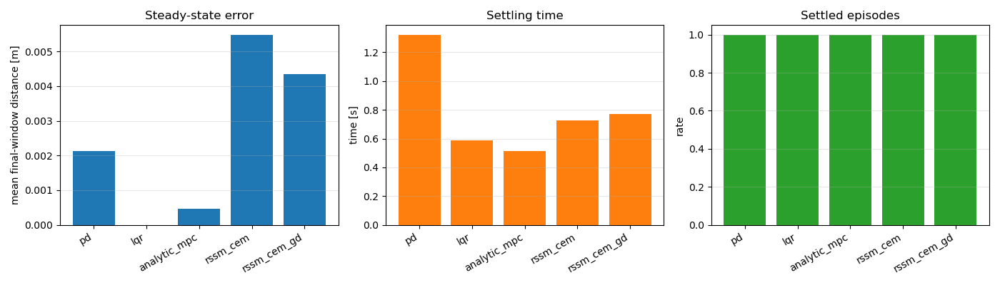
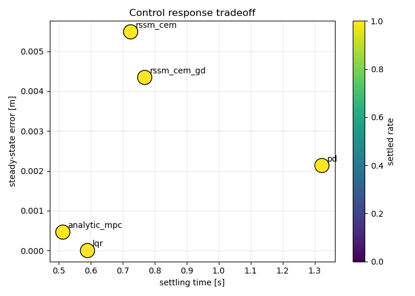

# Final PlaNet Workflow

This codebase is made by codex and human in reference reading -- ai coding - human reviewing - more ai coding -- (multiple rounds) -- human summary and cleaning fashion.  

Main Reference:
1. https://arxiv.org/pdf/1811.04551.pdf
2. https://medium.com/%40lukasbierling/recurrent-state-space-models-pytorch-implementation-ba5d7e063d11

This branch trains the RSSM with reward & continual model:

```text
obs_t, action_t -> RSSM posterior/prior latent state
latent state -> observation decoder
latent state -> reward model
```

The reward model follows the same idea as PlaNet/Dreamer-style RSSMs: concatenate deterministic state `h`
and stochastic state `z`, then predict scalar reward with an MLP. The implementation stays in the repo's
low-dimensional style while using `Buffer` as the data collection, NPZ I/O, and training dataset entry point.

## 1. Collect Offline Data

The known-good v1 collection recipe remains the default starting point:
We collect data with random, pd-control, mpc-control data.
TODO: correct above for --mode mpc_cover
```bash
python scripts/collect_dataset.py \
  --num-episodes 8000 \
  --max-episode-steps 300 \
  --mode mpc_cover \
  --pos-bound 0.45 \
  --vel-bound 0.30 \
  --angle-bound 0.15 \
  --target-bound 0.3 \
  --action-noise-std 0.04 \
  --seed 0 \
  --out data/ball_balance_mpc_v2_reward_normalized.npz
```

The dataset stores true environment rewards. With the current environment defaults, rewards are bounded for smooth
regression:

```text
normal step: 1 - ||ball_xy||^2 / (board_size / 2)^2, clipped to [-1, 1]
fall step:   -1 and terminated=True
```

```text
obs:    [N, T + 1, 6]
action: [N, T, 2]
reward: [N, T, 1]
done:   [N, T, 1]
```

`reward[:, t]` is the true reward from applying `action[:, t]` and reaching `obs[:, t + 1]`.

## 2. Train RSSM + Reward Model

```bash
python scripts/train_rssm.py \
  --dataset data/ball_balance_mpc_v2_reward_normalized.npz \
  --run-dir runs/rssm_ball_v5_long_wiz_reward_continual_model \
  --seq-len 200 \
  --batch-size 256 \
  --epochs 30
```

Rerunning the same command resumes automatically from `checkpoints/last.pt` when it exists, or
from the older `checkpoints/latest.pt` name for existing runs. `--epochs` is the total target epoch
count, so a checkpoint saved at epoch 37 continues with epoch 38 and stops after epoch 100. Use
`--no-resume` to intentionally start from scratch, or `--resume-from path/to/checkpoint.pt` to choose
a specific checkpoint.

Useful knobs:

```bash
--reward-loss-weight 1.0
--continuation-loss-weight 1.0         # continuation head BCE weight
--beta-kl 1.0
--free-nats 1.0
```

Training normalizes observation, action, and reward statistics from the training split. The loss is:

```text
total_loss = observation_reconstruction_mse
           + beta_kl * free_nats_clamped_kl
           + reward_loss_weight * reward_prediction_mse
           + continuation_loss_weight * continuation_bce
```

The reward loss uses `done` to mask out post-done padding transitions. TensorBoard also logs
`reward_loss_nonterminal`, `reward_loss_terminal`, and `reward_loss_post_done_padding` so terminal transitions
and artificial padding are visible separately. The model always trains a separate continuation head for
`terminated=False` versus `terminated=True`, so the reward head does not need to encode episode termination.

The checkpoint contains one model state dict with encoder, RSSM dynamics, observation decoder, and reward
model weights.


## 3.1 Evaluate Imagine Model Prediction

Evaluate posterior reconstruction, one-step prior prediction, open-loop observation prediction, and open-loop
reward prediction on the offline dataset:

```bash
python scripts/eval_rssm_prediction.py \
  --checkpoint runs/rssm_ball_v5_long_wiz_reward_continual_model/checkpoints/best.pt \
  --dataset data/ball_balance_mpc_v2_reward_normalized.npz \
  --context-len 10 \
  --horizon 50 \
  --num-batches 20 \
  --batch-size 128
```

Latest result from `runs/rssm_ball_v5_long_wiz_reward_continual_model`:

| Metric | Value |
| --- | ---: |
| posterior reconstruction MSE | 0.000570 |
| one-step prior MSE | 0.000572 |
| open-loop dynamics MSE | 0.007157 |
| posterior reward MSE | 0.427284 |
| open-loop reward MSE | 0.326146 |
| posterior continuation MSE | 0.0000129 |
| open-loop continuation MSE | 0.000563 |










To inspect what the reward model has learned over the board, sample transitions from the buffer dataset and average
true, posterior-predicted, and one-step-prior-predicted reward by next ball position. Each `(x, y)` bin averages over
the board angles and actions that produced transitions into that part of the board:

```bash
python scripts/eval_reward_heatmap.py \
  --checkpoint runs/rssm_ball_v5_long_wiz_reward_continual_model/checkpoints/best.pt \
  --dataset data/ball_balance_mpc_v2_reward_normalized.npz \
  --num-episodes 256 \
  --batch-size 32 \
  --bins 50 \
  --position-limit 0.5
```

Reward heatmap result:

| Metric | Value |
| --- | ---: |
| sampled transitions | 60,102 |
| filled position bins | 2,184 |
| mean true reward | 0.738892 |
| mean posterior reward | 0.742141 |
| mean prior reward | 0.742040 |
| posterior reward MSE | 0.000206 |
| prior reward MSE | 0.000216 |



## 3.2 Evaluate RSSM based mpc planner

To evaluate closed-loop center stabilization in the true environment with the current MPC stack, run the same
checkpoint through both planners. Plain CEM:

```bash
python scripts/eval_rssm_mpc.py \
  --checkpoint runs/rssm_ball_v5_long_wiz_reward_continual_model/checkpoints/best.pt \
  --mode center \
  --planning-objective reward \
  --planner-type cem \
  --num-episodes 50 \
  --max-steps 300 \
  --horizon 25 \
  --num-candidates 1024 \
  --num-elites 100 \
  --num-iterations 4
```

Online center-task result with the same checkpoint and CEM planner (`5` episodes, `150` max steps):

| Metric | Value |
| --- | ---: |
| success rate | 100% |
| fall rate | 0% |
| final distance | 0.0099 |
| last-50 distance | 0.0122 |
| total reward | 136.21 |
| mean compute time / action | 16.7 ms |
| control frequency | 60.0 Hz |



CEM with gradient refinement:

```bash
python scripts/eval_rssm_mpc.py \
  --checkpoint runs/rssm_ball_v5_long_wiz_reward_continual_model/checkpoints/best.pt \
  --mode center \
  --planning-objective reward \
  --planner-type cem_gd \
  --num-episodes 50 \
  --max-steps 300 \
  --horizon 25 \
  --num-candidates 1024 \
  --num-elites 100 \
  --num-iterations 4 \
  --gd-num-sequences 3 \
  --gd-iterations 15 \
  --gd-lr 0.01
```

Online center-task result with CEM-GD (`5` episodes, `100` max steps):

| Metric | Value |
| --- | ---: |
| success rate | 80% |
| fall rate | 0% |
| final distance | 0.0314 |
| last-50 distance | 0.0337 |
| total reward | 86.31 |
| mean compute time / action | 172.1 ms |
| control frequency | 5.8 Hz |



To compare center-stabilization methods from identical random initial states, run the full baseline comparison:

```bash
python scripts/compare_center_baselines.py \
  --checkpoint runs/rssm_ball_v5_long_wiz_reward_continual_model/checkpoints/best.pt \
  --methods pd,lqr,mpc_cem,mpc_mppi,mpc_gd,rssm_cem,rssm_cem_gd \
  --num-episodes 20 \
  --max-steps 300 \
  --horizon 25 \
  --num-candidates 1024 \
  --num-elites 100 \
  --num-iterations 4 \
  --planning-objective reward
```

This evaluates:

- `pd`: full-state hand-written PD.
- `lqr`: full-state LQR from the linearized visible dynamics.
- `mpc_cem`: full-state true-dynamics MPC using CEM.
- `mpc_mppi`: full-state true-dynamics MPC using MPPI.
- `mpc_gd`: full-state true-dynamics direct-shooting gradient MPC, an optimization-based baseline in the same family as iLQR/DDP but using autodiff and projected Adam instead of a Riccati backward pass.
- `rssm_cem`: learned RSSM MPC with CEM.
- `rssm_cem_gd`: learned RSSM MPC with CEM plus gradient refinement.

The comparison includes control-response metrics:

- `steady_state_error`: mean distance-to-center over the final `--steady-window` observations.
- `steady_state_rmse`: RMS distance-to-center over the same final window.
- `settling_time_sec`: first time after which distance remains within `--settling-threshold`; if an episode never settles, this is the episode duration and `settled=false`.
- `settled_rate`: fraction of episodes that settled by that definition.
- `mean_compute_time`, `median_compute_time`, `p95_compute_time`, and `max_compute_time`: wall-clock planner latency per control step.
- `total_compute_time`: total wall-clock planning time per episode.
- `control_frequency_hz`: inverse of mean per-step compute time.
- `compute_real_time_factor`: total compute time divided by simulated episode time; values below `1` are faster than real time.

Latest center-baseline comparison result:

| Method | Success | Final dist. | Steady error | Settling time | Mean compute |
| --- | ---: | ---: | ---: | ---: | ---: |
| PD | 100% | 0.00068 | 0.00213 | 1.323 s | 0.003 ms |
| LQR | 100% | 0.00000 | 0.00000 | 0.590 s | 0.003 ms |
| analytic MPC | 100% | 0.00039 | 0.00046 | 0.513 s | 13.0 ms |
| RSSM CEM | 100% | 0.00494 | 0.00549 | 0.725 s | 20.5 ms |
| RSSM CEM-GD | 100% | 0.00480 | 0.00434 | 0.769 s | 179.9 ms |






[Optional]
To stress-test learned MPC generalization, start the ball from heatmap bins that were rare or completely unvisited in
the offline buffer. This uses `reward_heatmap_data.npz` from the reward heatmap evaluation, samples initial `(x, y)`
positions from bins with `count <= --max-count`, and then runs RSSM MPC from those states:

```bash
python scripts/eval_rssm_mpc_unvisited.py \
  --checkpoint runs/rssm_ball_v5_long_wiz_reward_continual_model/checkpoints/best.pt \
  --heatmap-data runs/rssm_ball_v5_long_wiz_reward_continual_model/reward_heatmap/reward_heatmap_data.npz \
  --planner-type both \
  --planning-objective reward \
  --num-episodes 1 \
  --max-count 0 \
  --max-steps 300 \
  --horizon 25 \
  --num-candidates 1024 \
  --num-elites 100 \
  --num-iterations 4 \
  --save-plots
```


## 4. Online visualizer 

For via-point tasks, keep `state_cost`. The true environment reward used by the current reward model does not
include arbitrary via-point targets:

```bash
python scripts/online_mpc_visualizer.py \
  --checkpoint runs/rssm_ball_v5_long_wiz_reward_continual_model/checkpoints/best.pt \
  --task viapoint \
  --num-episodes 5 \
  --max-steps 150 \
  --pos-bound 0.25 \
  --vel-bound 0.10 \
  --angle-bound 0.05 \
  --target-bound 0.18 \
  --planning-objective state_cost
```

Center reward-planning visualizer:

```bash
python scripts/online_mpc_visualizer.py \
  --checkpoint runs/rssm_ball_v5_long_wiz_reward_continual_model/checkpoints/best.pt \
  --task center \
  --num-episodes 5 \
  --max-steps 150 \
  --planning-objective reward \
  --planner-type cem_gd \
  --render-fps 120 \
  --show-online not-show
```

or   
```bash
--planner-type cem, cem_gd
--show-online show, not-show
```

Saved online dashboard examples from the reward-aware RSSM checkpoint:

- CEM: `results/rssm_v5_online_mpc_cem.gif`
- CEM-GD: `results/rssm_v5_online_mpc_cem_gd.gif`
